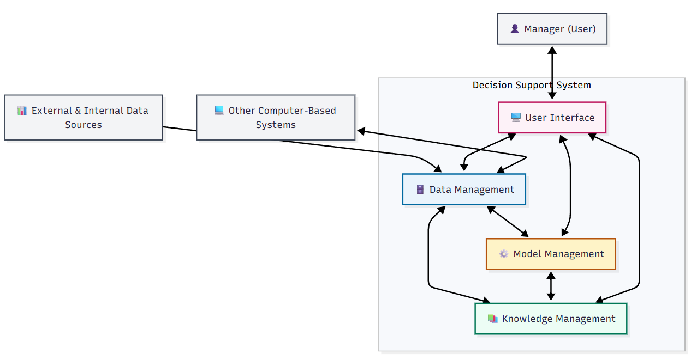

# Decision Support System for Carbon Tax Policy

This project implements a Decision Support System (DSS) for evaluating
carbon tax policies across Indonesian provinces, using hybrid models
(LSTM + ANFIS) and an interactive Streamlit dashboard.

## 🚀 Features
- Data preprocessing and normalization (2010–2020 historical data).
- LSTM model for forecasting greenhouse gas emissions and poverty rates (2021–2030).
- ANFIS (Sugeno-1) for adaptive taxation policy scoring.
- Integration of historical + predicted data for scenario analysis.
- Interactive visualization dashboard with Streamlit.

## 🏛 DSS Architecture

This DSS follows the **classical four-subsystem architecture**:

- **Data Management Subsystem**: preprocessing, normalization, province references.  
- **Model Management Subsystem**: LSTM + ANFIS predictive models.  
- **Knowledge Management Subsystem**: policy scoring, scenario optimizer, scenario analysis.  
- **User Interface Subsystem**: Streamlit-based dashboard for decision makers.

## 📊 Models
- **LSTM**: Trained on historical sequences (2010–2020), using a 3-year sliding window.  
- **ANFIS (Sugeno-1)**: Uses Gaussian membership functions to score policies adaptively.

## 📂 Project Structure
- `dataprep/` – preprocessing, normalization, province reference mapping
- `models/` – LSTM and ANFIS model implementations
- `predict.py` – future prediction (2021–2030)
- `ui/` – Streamlit dashboard
- `outputs/` – saved models and combined datasets
- `docs/` – extended documentation

## 📂 Documentation

For a detailed breakdown of the code architecture, data flow, and technical
explanations of the models:

- [Code Flow Documentation](docs/code_flow.md) — full technical overview of
  data preparation, LSTM & ANFIS model design, prediction workflow, and output
  generation.

This complements the main README by providing an in-depth, academic-style
explanation of how the Decision Support System is implemented.

## 🎯 SDGs Relevance
This work contributes to:  
- **SDG 13 (Climate Action)**  
- **SDG 1 (No Poverty)**  
- **SDG 8 (Decent Work and Economic Growth)**

## 📜 Citation
If you use this project in academic work, please cite using the `CITATION.cff` file.

---
